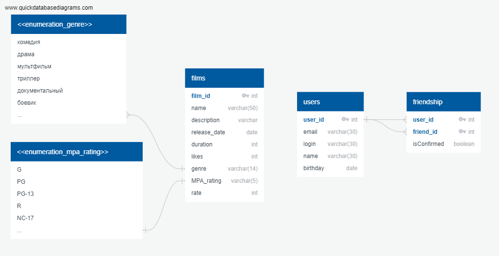

# java-filmorate

### ER-диаграмма базы данных проекта java-filmorate

### Таблица users (пример)"

| user_id |      email      | login  |    name     |  birthday   |
|:-------:|:---------------:|:------:|:-----------:|:-----------:|
|    1    |  user1@mail.ru  | user_1 | user_1_name | 1980-01-01  |
|    2    |  user2@mail.ru  | user_2 | user_2_name | 1920-04-21  |
|    3    |  user3@mail.ru  | user_3 | user_3_name | 1990-05-14  |
|    4    |  user4@mail.ru  | user_4 | user_4_name | 1995-02-17  |
|    5    |  user5@mail.ru  | user_5 | user_5_name | 1992-03-19  |

#### Индексы:  

"users_pkey" PRIMARY KEY, btree (user_id)   
"uq_users_email" UNIQUE CONSTRAINT, btree (email)   

#### Ссылки извне:  

TABLE "friendship" CONSTRAINT "friendship_friend_id_fkey" FOREIGN KEY (friend_id) REFERENCES users(user_id)  
TABLE "friendship" CONSTRAINT "friendship_user_id_fkey" FOREIGN KEY (user_id) REFERENCES users(user_id)  

 

### Таблица friendship (пример)

| user_id | friend_id | is_confirmed |
|:-------:|:---------:|:------------:|
|    1    |     2     |     true     |
|    2    |     1     |     true     |
|    1    |     3     |     true     |
|    3    |     1     |     true     |
|    1    |     4     |    false     |
|    1    |     5     |    false     |

#### Индексы:  

"friendship_pkey" PRIMARY KEY, btree (user_id, friend_id)  

#### Ограничения-проверки:  

"chk_if_equal" CHECK (user_id <> friend_id)  

#### Ограничения внешнего ключа:  

"friendship_friend_id_fkey" FOREIGN KEY (friend_id) REFERENCES users(user_id)  
"friendship_user_id_fkey" FOREIGN KEY (user_id) REFERENCES users(user_id)

 

### Таблица users_liked_films (пример)
| user_id | film_id |
|:-------:|:-------:|
|    1    |    4    |
|    2    |    5    |
|    1    |    3    |
|    1    |    1    |

#### Индексы:  

"user_film_id" PRIMARY KEY, btree (user_id, film_id)  

#### Ограничения внешнего ключа:  

"users_liked_films_film_id_fkey" FOREIGN KEY (film_id) REFERENCES films(film_id)  
"users_liked_films_user_id_fkey" FOREIGN KEY (user_id) REFERENCES users(user_id)  

 

### Таблица mpa_rating (пример)
| mpa_rating_id | name  |
|:-------------:|:------|
|       1       | G     |
|       2       | PG    |
|       3       | PG-13 |
|       4       | R     |
|       5       | NC-17 |

#### Индексы:  
"mpa_ratings_pkey" PRIMARY KEY, btree (mpa_rating_id)  
 

#### Примеры запросов:

#### 1. Получить список имен всех друзей пользователя с id=1

SELECT f.user_id AS USER_ID, u.name AS FRIEND_NAME  
FROM friendship AS f  
INNER JOIN users AS u ON u.user_id = f.friend_id  
WHERE f.user_id = 1 AND f.is_confirmed IS TRUE;  

#### Вывод:

| user_id | friend_name |
|:-------:|:-----------:|
|    1    | user_2_name |
|    1    | user_3_name |

 

#### 2. Посчитать количество друзей у пользователя с id=1

SELECT user_id, COUNT(*)  
FROM friendship  
WHERE user_id=1 AND is_confirmed IS TRUE  
GROUP BY user_id;  

#### Вывод:

| user_id | count |
|:-------:|:-----:|
|    1    |   2   |

 

#### 3. Получить список пользователей, запросивших дружбу у пользователя id=1

SELECT user_id, friend_id AS REQUEST_FROM  
FROM friendship  
WHERE user_id = 1 AND is_confirmed IS FALSE  
GROUP BY user_id, friend_id;  

#### Вывод:

| user_id | request_from |
|:-------:|:------------:|
|    1    |      4       |
|    1    |      5       |

 

#### 4. Получить имя и список id любимых фильмов пользователя с id=1

SELECT u.user_id AS id, u.name AS name, ulf.film_id  
FROM users AS u  
INNER JOIN users_liked_films AS ulf ON ulf.user_id = u.user_id  
WHERE u.user_id = 1;  

#### Вывод:

| id  |     name     | film_id |
|:---:|:------------:|:-------:|
|  1  | user_1_name  |    4    |
|  1  | user_1_name  |    3    |
|  1  | user_1_name  |    1    |

 

#### 5. Получить названия фильмов пользователя с id=1 и вывести в алфавитном порядке

SELECT ulf.user_id AS id, f.name AS name  
FROM users_liked_films AS ulf  
INNER JOIN films AS f ON ulf.film_id = f.film_id  
WHERE ulf.user_id = 1  
ORDER BY f.name ASC;  

#### Вывод:

| id  | name         |
|:---:|:-------------|
|  1  | Интерстеллар |
|  1  | Начало       |
|  1  | Отступники   |

 

### Таблица films (пример)

| film_id | name                               | description        | release_date | duration | mpa_rating | rate |
|:-------:|------------------------------------|--------------------|--------------|:--------:|:-----------|:----:|
|    1    | Отступники                         | \*описание фильма* | 2006-01-01   |   151    | NC-17      |  10  |
|    2    | Умница Уилл Хантинг                | \*описание фильма* | 1997-01-01   |   126    | PG         |  9   |
|    3    | Начало                             | \*описание фильма* | 2010-01-01   |   148    | PG-13      |  8   |
|    4    | Интерстеллар                       | \*описание фильма* | 2014-01-01   |   169    | G          |  8   |
|    5    | Темный рыцарь: Возрождение легенды | \*описание фильма* | 2012-01-01   |   164    | PG-13      |  7   |

#### Индексы:

"films_pkey" PRIMARY KEY, btree (film_id)  

#### Ограничения-проверки:

"chk_mpa_rating" CHECK (mpa_rating::text = 'G'::text OR mpa_rating::text = 'PG'::text   
OR mpa_rating::text = 'PG-13'::text OR mpa_rating::text = 'R'::text OR mpa_rating::text = 'NC-17'::text)  

 

### Таблица genres (пример)

| genre_id | name           |
|:--------:|:---------------|
|    1     | комедия        |
|    2     | драма          |
|    3     | мультфильм     |
|    4     | триллер        |
|    5     | документальный |
|    6     | боевик         |

#### Индексы:

"genres_pkey" PRIMARY KEY, btree (genre_id)
#### Ссылки извне:

TABLE "films_genres" CONSTRAINT "films_genres_genre_id_fkey" FOREIGN KEY (genre_id) REFERENCES genres(genre_id)

 

### Таблица films_genres (пример)

| film_id | genre_id  |
|:-------:|:---------:|
|    1    |     6     |
|    2    |     2     |
|    3    |     4     |
|    4    |     4     |
|    5    |     6     |

#### Индексы:

"films_genre_id" PRIMARY KEY, btree (film_id, genre_id)
#### Ограничения внешнего ключа:

"films_genres_film_id_fkey" FOREIGN KEY (film_id) REFERENCES films(film_id)
"films_genres_genre_id_fkey" FOREIGN KEY (genre_id) REFERENCES genres(genre_id)

#### Примеры запросов:

#### 1. топ-3 фильмов по количеству лайков с сортировкой по уменьшению:

SELECT f.film_id AS film_ID, f.name AS film_name, f.likes  
FROM films AS f  
ORDER BY f.likes DESC  
LIMIT 3;  

#### Вывод:

| film_ID | film_name                          | likes   |
|:-------:|------------------------------------|---------|
|    3    | Начало                             | 2285903 |
|    4    | Интерстеллар                       | 1747726 |
|    5    | Темный рыцарь: Возраждение легенды | 1663443 |

 

#### 2. Вывести название, дату резиза и продолжительность фильмов, вышедших до 2000 г. Отсортировать по алфавиту:

SELECT f.name, f.release_date, f.duration  
FROM films AS f  
WHERE EXTRACT(year from f.release_date) < '2000'  
ORDER BY name ASC;  

#### результат запроса:

| name                | release_date |  duration  |
|---------------------|:------------:|:----------:|
| Умница Уилл Хантинг |  1997-01-01  |     96     |

 

#### 3. Вывести все фильмы (рейтинг, id и название) категории "PG-13". Отсортировать по алфавиту:

SELECT mpa_rating AS rating, f.film_id AS id, f.name   
FROM films as f  
WHERE mpa_rating = 'PG-13'  
ORDER BY f.name ASC;  

#### результат запроса:

| rating | id  | name                               |
|:------:|:---:|------------------------------------|
| PG-13  |  3  | Начало                             |
| PG-13  |  5  | Темный рыцарь: Возрождение легенды |
